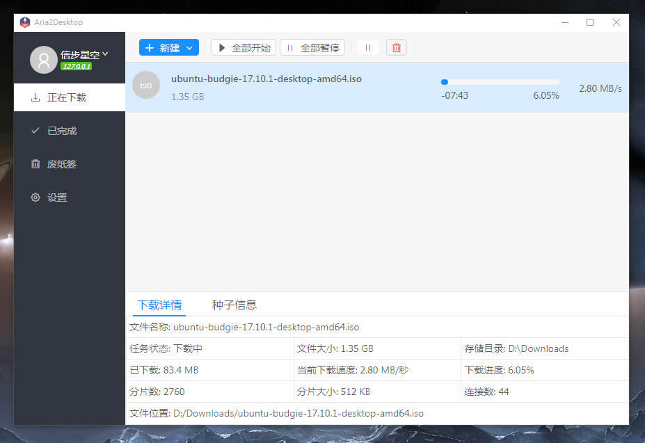
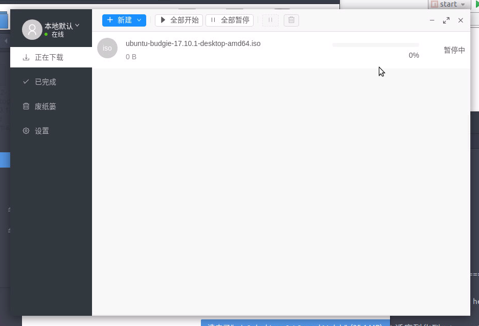
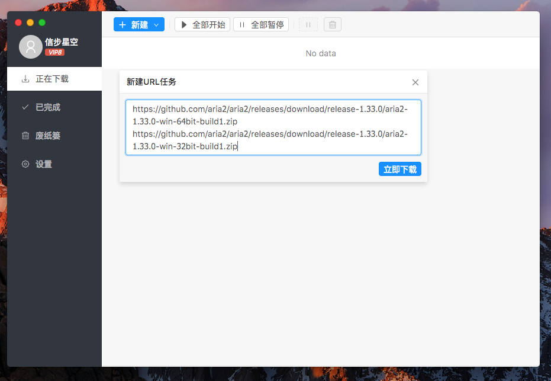
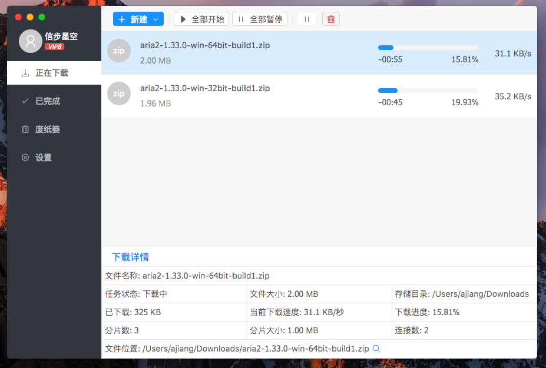
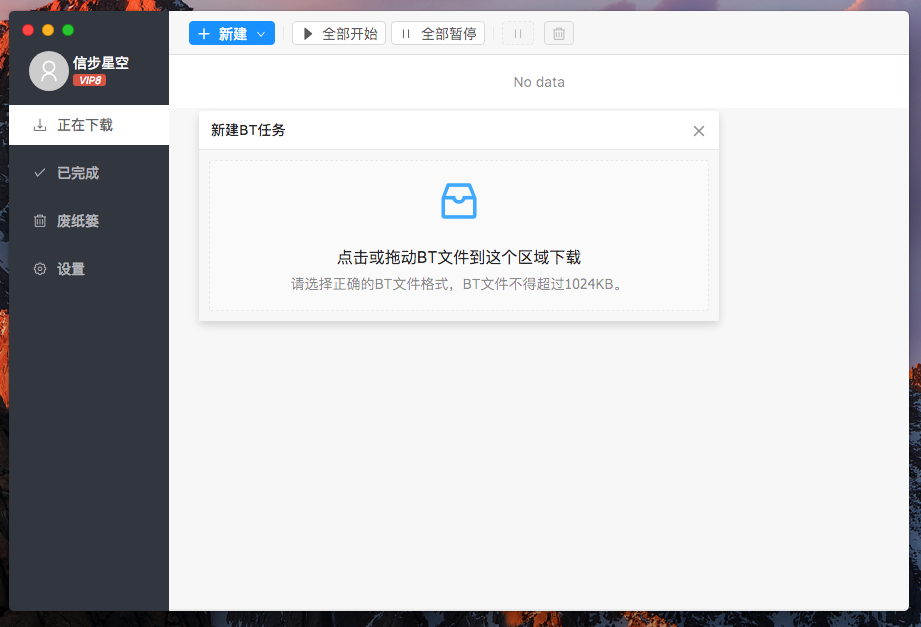

# aria2desktop

#### 一个aria2的UI界面
这是一个基于 electron 开发的aria2控制界面。

如果你只想体验一下，直接下载打包好的安装程序就好了。

在线体验 http://wapznw.gitee.io/aria2desktop
```
本地默认Aria2服务如果启用了secret,请在url后面加上#secret。
如http://wapznw.gitee.io/aria2desktop/#ooxxoo
```

体验完整功能请下载客服端
---
[下载Mac版](../../releases)


[下载Windows版](../../releases)


[下载Ubuntu版](../../releases)
> 如果启动内置aria2失败，尝试安装 sudo apt install libc-ares2 -y

> 或安装 aria2_1.33.1-1_amd64.deb

开发
```
npm run start
npm run electron:dev
```

编译
```
npm install
npm run build
```
打包执行程序
打包使用的 electron-builder，如果你没安装请先安装。
```
npm install -g electron-builder
```

```
# mac
./build-release.sh mac

#windows
./build-release.sh win
```
生成的文件在 $(projectRoot)/build/dist 目录下

## windows10运行截图


## Ubuntu 运行截图


## Mac 运行截图

---

---

---


---


---


---

